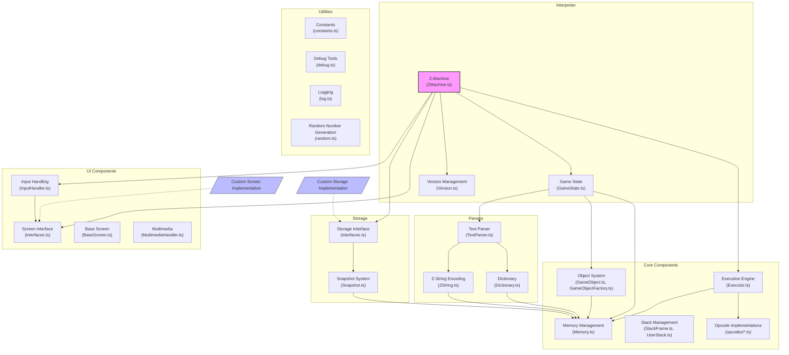

# rezrov-zmachine

A modular **Z-machine** interpreter written in TypeScript.

## About the Z-Machine

The **Z-Machine** is a virtual machine developed by _Infocom_ in 1979 to run interactive fiction games, most famously titles like _Zork_ and _Planetfall_. It was designed to be platform-independent, allowing Infocom to write a game once and run it on a wide variety of computer systems by porting just the interpreter.

Z-Machine story files (typically with `.z1` to `.z8` extensions) contain a compiled game program in a custom bytecode format. The interpreter is responsible for executing this bytecode, managing game state, handling input/output, and presenting the text-based adventure.

Over the years, the format has evolved through several versions, from v1 (used for early games) up to v8, with each version introducing new features and capabilities. Today, the Z-Machine is still supported by hobbyist interpreters and authoring tools, and remains a cornerstone of the interactive fiction community.

### Key Resources

- [**The Z-Machine Standards Document (Inform Fiction)**](https://inform-fiction.org/zmachine/standards/z1point1/index.html)
  The official and most detailed technical specification for all versions of the Z-Machine.

- [**The Inform 6 Compiler**](https://github.com/DavidKinder/Inform6)
  A popular compiler that produces Z-Machine story files from source code written in the Inform language.

- [**IF Archive: Z-Machine**](https://ifarchive.org/indexes/if-archiveXinfocomXinterpretersXzcode.html)
  A repository of Z-Machine interpreters and tools.

- [**The Digital Antiquarian: Infocom History**](https://www.filfre.net/tag/infocom/)
  A great historical deep-dive into Infocom and the evolution of its technology.

## Acknowledgments

This project is a port/refactoring of the [ebozz](https://github.com/toshok/ebozz) Z-machine implementation by Chris Toshok. While maintaining the same general architecture, rezrov-zmachine aims to modernize the codebase and improve modularity.

## Project Features

- **Fully modular design**: Clear separation between core interpreter, UI, storage, and parsing components
- **TypeScript implementation**: Strong typing for better development experience
- **High compatibility**: Support for Z-machine versions 1 through 8
- **Extensible interfaces**: Easily create custom UI and storage implementations
- **Modern architecture**: Promise-based APIs for asynchronous operations
- **Comprehensive object model**: Full support for the Z-machine object system

## Implementation Status

Currently implemented:

- Core VM functionality for Z-machine versions 3-5
- Basic object system
- Text parsing and dictionary handling
- Memory management

In progress:

- Complete porting and restructuring of the code
- Full support for Z-machine versions 1-3
- Extended opcodes for versions 5+

## Roadmap

- [ ] Complete implementation of all Z-machine versions
- [ ] Add example UI implementations (terminal, web, etc.)
- [ ] Implement graphics support for V6 games

## Installation

### From npm (not yet published)

```bash
npm install rezrov-zmachine
```

### From source

```bash
git clone https://github.com/yourusername/rezrov-zmachine.git
cd rezrov-zmachine
npm install
npm run build
```

## Development

This project uses TypeScript and follows modern ES module patterns.

### Setting up the development environment

```bash
npm install
```

### Running Tests

The project includes a comprehensive test suite:

```bash
# Run all tests
npm test

# Run unit tests
npm run test:unit

# Run integration tests
npm run test:integration

# Run Z-machine compliance tests
npm run test:compliance
```

## Usage

### Basic Example

```typescript
import { ZMachine, Memory, BaseScreen, Logger, LogLevel } from 'rezrov-zmachine';
import fs from 'fs';

// Create a simple in-memory storage implementation
class InMemoryStorage {
  private snapshot: any = null;

  saveSnapshot(snapshot: any): void {
    this.snapshot = snapshot;
  }

  loadSnapshot(): any {
    if (!this.snapshot) {
      throw new Error('No snapshot available');
    }
    return this.snapshot;
  }
}

// Load a story file
const storyData = fs.readFileSync('path/to/zork1.z3');

// Create the components
const logger = new Logger(LogLevel.INFO);
const screen = new BaseScreen(logger, 'console');
const storage = new InMemoryStorage();

// Create the Z-machine
const machine = new ZMachine(storyData, logger, screen, storage);

// Execute the program
machine.execute();

// In a real implementation, you would need to handle input/output
// by creating a custom Screen implementation that connects to your
// desired UI system (terminal, web, etc.)
```

## Architecture

Rezrov-ZMachine uses a layered architecture that separates the Z-Machine's core functions from interface implementations, making it adaptable to various environments. The diagram below illustrates the key components and their relationships:



### Core Components

- **Memory Management**: Handles all memory operations for the Z-Machine, including reading/writing bytes and words.
- **Execution Engine**: Executes Z-code instructions by decoding and dispatching opcodes.
- **Stack System**: Manages the evaluation stack and call frames for routine execution.
- **Object System**: Implements the Z-Machine's object tree and property system.
- **Opcode Implementations**: Provides implementations for all Z-Machine operations grouped by function.

### Interpreter

- **Z-Machine**: The main controller orchestrating execution and integrating all components.
- **Game State**: Maintains the current state of the game world, including memory, stack, and callstack.
- **Version Management**: Handles differences between Z-Machine versions (1-8).

### UI Components

- **Screen Interface**: Abstract interface for all display operations.
- **Base Screen**: Provides default implementations of screen operations.
- **Input Handling**: Processes user input for text and keypress operations.
- **Multimedia**: Handles graphics and sound for supported Z-Machine versions.

### Storage

- **Storage Interface**: Abstract interface for save/restore operations.
- **Snapshot System**: Manages game state serialization and deserialization.

### Parsers

- **Dictionary**: Manages the game's word dictionary and lookup operations.
- **Text Parser**: Handles tokenization of input text.
- **Z-String**: Provides encoding/decoding of Z-Machine strings.

### Extensibility

The architecture is designed to be extensible. You can create custom implementations of:

- Screen interfaces for different platforms (web, terminal, native UI)
- Storage systems for different environments (file system, browser storage, cloud)
- Input handlers for different interaction methods

This modular design allows the interpreter to run in various environments while maintaining the same core Z-Machine functionality.

## Creating a Custom Screen Implementation

The interpreter is designed to work with any UI system. You can create your own screen implementation by implementing the `Screen` interface:

```typescript
import { Screen, Capabilities, ScreenSize, ZMachine, InputState } from 'rezrov-zmachine';

export class MyCustomScreen implements Screen {
  getCapabilities(): Capabilities {
    return {
      hasColors: true,
      hasBold: true,
      hasItalic: true,
      hasReverseVideo: true,
      hasFixedPitch: true,
      hasSplitWindow: true,
      hasDisplayStatusBar: true,
      hasPictures: false,
      hasSound: false,
      hasTimedKeyboardInput: false,
    };
  }

  getSize(): ScreenSize {
    return { rows: 25, cols: 80 };
  }

  print(machine: ZMachine, text: string): void {
    // Your implementation here
  }

  // Additional methods for the Screen interface...
}
```

## Custom Storage Implementation

Similarly, you can create your own storage implementation for save/restore functionality:

```typescript
import { Storage, Snapshot } from 'rezrov-zmachine';

export class MyCustomStorage implements Storage {
  saveSnapshot(snapshot: Snapshot): void {
    // Your implementation here
  }

  loadSnapshot(): Snapshot {
    // Your implementation here
  }
}
```

## Working with Game Objects

The Z-machine has a sophisticated object system. You can interact with game objects like this:

```typescript
// Get an object by number
const obj = machine.state.getObject(42);

// Get object attributes and properties
if (obj && obj.hasAttribute(21)) {
  console.log(`Object ${obj.name} is a container`);
  const capacity = obj.getProperty(18);
  console.log(`It can hold ${capacity} items`);
}

// Modify objects
obj.setAttribute(10); // Make it openable
obj.clearAttribute(2); // Make it not locked

// Move objects in the object tree
const box = machine.state.getObject(23);
const key = machine.state.getObject(37);
if (box && key) {
  key.parent = box; // Put the key in the box
}
```

## Examples

Check the `examples` directory for complete working examples:

- `BasicInterpreter.ts` - A simple command-line interpreter
- `GameObjectExample.ts` - Exploring the game object tree
- `WebInterpreter.ts` - A web-based interpreter

## Contributing

Contributions are welcome! Please feel free to submit a Pull Request.

## License

MIT
