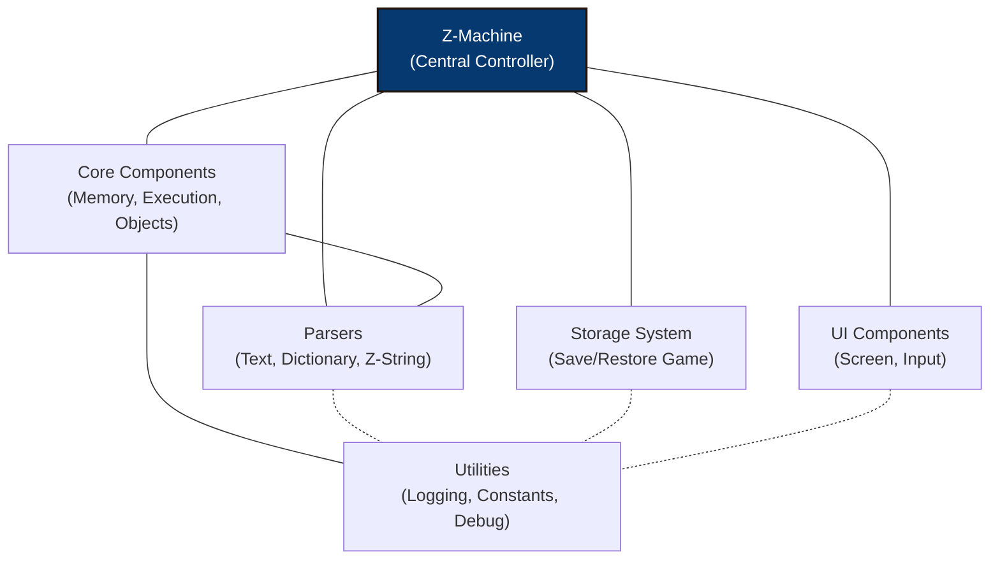

# rezrov-zmachine

A modular **Z-machine** interpreter written in TypeScript.

## About the Z-Machine

The **Z-Machine** is a virtual machine developed by _Infocom_ in 1979 to run interactive fiction games, most famously titles like _Zork_ and _Planetfall_. It was designed to be platform-independent, allowing Infocom to write a game once and run it on a wide variety of computer systems by porting just the interpreter.

Z-Machine story files (typically with `.z1` to `.z8` extensions) contain a compiled game program in a custom bytecode format. The interpreter is responsible for executing this bytecode, managing game state, handling input/output, and presenting the text-based adventure.

Over the years, the format has evolved through several versions, from v1 (used for early games) up to v8, with each version introducing new features and capabilities. Today, the Z-Machine is still supported by hobbyist interpreters and authoring tools, and remains a cornerstone of the interactive fiction community.

### Key Resources

- [**The Z-Machine Standards Document (Inform Fiction)**](https://inform-fiction.org/zmachine/standards/z1point1/index.html)
  The official and most detailed technical specification for all versions of the Z-Machine.

- [**The Inform 6 Compiler**](https://github.com/DavidKinder/Inform6)
  A popular compiler that produces Z-Machine story files from source code written in the Inform language.

- [**IF Archive: Z-Machine**](https://ifarchive.org/indexes/if-archiveXinfocomXinterpretersXzcode.html)
  A repository of Z-Machine interpreters and tools.

- [**The Digital Antiquarian: Infocom History**](https://www.filfre.net/tag/infocom/)
  A great historical deep-dive into Infocom and the evolution of its technology.

- [**Quetzal Z-machine Common Save-File Format**](https://inform-fiction.org/zmachine/standards/quetzal/index.html)
  Quetzal is a standardized file format for the saved state of Z-machine games, invented by Martin Frost.

## Acknowledgments

This project is a port/refactoring of the [ebozz](https://github.com/toshok/ebozz) Z-machine implementation by Chris Toshok. While maintaining the same general architecture, rezrov-zmachine aims to modernize the codebase and improve modularity.

## Project Features

- **Fully modular design**: Clear separation between core interpreter, UI, storage, and parsing components
- **TypeScript implementation**: Strong typing for better development experience
- **High compatibility**: Full support for Z-machine versions 1-5, with V6-V8 in progress
- **Extensible interfaces**: Easily create custom UI and storage implementations
- **Modern architecture**: Promise-based APIs for asynchronous operations
- **Comprehensive object model**: Full support for the Z-machine object system

## Implementation Status

### Core Interpreter

- **Execution engine**: Complete fetch-decode-execute loop supporting all instruction forms (short, long, variable, extended)
- **Opcodes**: 100+ opcodes implemented across 12 categories (math, control, memory, stack, call, string, I/O, object, game, graphics)
- **Memory management**: Full implementation with header validation, dynamic/static/high memory regions, and packed address unpacking
- **Object system**: Complete object tree traversal, attribute/property manipulation, and version-specific layouts (V1-V3 and V4+)
- **Text parsing**: Z-string encoding/decoding with abbreviation tables, custom alphabets (V5+), and dictionary lookup
- **Save/restore**: Quetzal and Enhanced .dat format support with three storage providers (filesystem, browser localStorage, in-memory)
- **Undo**: 10-level undo stack via save_undo/restore_undo

### Z-Machine Version Support

| Version | Status              | Notes                                                                                                                  |
| ------- | ------------------- | ---------------------------------------------------------------------------------------------------------------------- |
| V1-V3   | **Complete**        | Fully tested with classic Infocom titles                                                                               |
| V4      | **Complete**        | Extended opcodes and expanded object table                                                                             |
| V5      | **Mostly complete** | Core support working; advanced screen features still being validated against Beyond Zork                               |
| V6      | **Partial**         | Architecture present, basic graphics opcodes delegate to multimedia handler; ~11 windowing opcodes not yet implemented |
| V7-V8   | **Partial**         | Version detection and address calculations defined; not yet tested with story files                                    |

### UI and Examples

- **Window management**: Split-window support with status bar and scrollable main text
- **Font system**: Font 3 bitmap and Unicode mapping support
- **Example implementations**: Two complete working interpreters — a basic console (readline-sync + chalk) and an advanced terminal UI (blessed with split windows)

## Roadmap

- [ ] Complete V5 screen model validation (Beyond Zork extended screen features)
- [ ] Implement remaining V6 windowing opcodes (set_margins, move_window, window_size, etc.)
- [ ] Full graphics and multimedia handler for V6 games
- [ ] Implement `encode_text` and `print_form` opcodes
- [ ] V7-V8 story file testing and validation
- [ ] Publish to npm registry
- [ ] Add web-based example implementation

## Installation

### From npm (not yet published)

```bash
npm install rezrov-zmachine
```

### From source

```bash
git clone https://github.com/yourusername/rezrov-zmachine.git
cd rezrov-zmachine
npm install
npm run build
```

## Development

This project uses TypeScript and follows modern ES module patterns.

### Setting up the development environment

```bash
npm install
```

### Running Tests

The project includes a comprehensive test suite:

```bash
# Run all tests
npm test

# Run unit tests
npm run test:unit

# Run integration tests
npm run test:integration

# Run Z-machine compliance tests
npm run test:compliance
```

## Architecture

Rezrov-ZMachine uses a layered architecture that separates the Z-Machine's core functions from interface implementations, making it adaptable to various environments. The diagram below illustrates the key components and their relationships:

### Architecture Overview

The high-level diagram shows the main architectural components and their relationships:



- **Z-Machine**: The central controller that orchestrates all other components
- **Core Components**: The essential parts of the Z-machine implementation (memory, execution, objects)
- **Parser System**: Handles text parsing, dictionaries, and Z-string encoding/decoding
- **Storage System**: Manages save/restore functionality using the Quetzal format
- **UI Components**: Defines interfaces and implementations for user interaction
- **Utilities**: Cross-cutting concerns like logging and constants

### Extensibility

The architecture is designed to be extensible. You can create custom implementations of:

- Screen interfaces for different platforms (web, terminal, native UI)
- Storage systems for different environments (file system, browser storage, cloud)
- Input handlers for different interaction methods

This modular design allows the interpreter to run in various environments while maintaining the same core Z-Machine functionality.

## Creating a Custom Screen Implementation

The interpreter is designed to work with any UI system. You can create your own screen implementation by implementing the `Screen` interface:

```typescript
import { BaseScreen, Capabilities, ScreenSize, ZMachine, InputState } from 'rezrov-zmachine';

export class MyCustomScreen extends BaseScreen {
  getCapabilities(): Capabilities {
    return {
      hasColors: true,
      hasBold: true,
      hasItalic: true,
      hasReverseVideo: true,
      hasFixedPitch: true,
      hasSplitWindow: true,
      hasDisplayStatusBar: true,
      hasPictures: false,
      hasSound: false,
      hasTimedKeyboardInput: false,
    };
  }

  getSize(): ScreenSize {
    return { rows: 25, cols: 80 };
  }

  print(machine: ZMachine, text: string): void {
    // Your implementation here
  }

  // Additional methods for the Screen interface...
}
```

## Custom Storage Provider

You can create your own storage provider for save/restore functionality by implementing the `StorageProvider` interface:

```typescript
import { StorageProvider } from 'rezrov-zmachine';

export class MyStorageProvider implements StorageProvider {
  async read(location: string): Promise<Buffer | null> {
    // Read save data from your storage backend
  }

  async write(location: string, data: Buffer): Promise<void> {
    // Write save data to your storage backend
  }

  async list(pattern?: string): Promise<string[]> {
    // List available save files
  }

  async exists(location: string): Promise<boolean> {
    // Check if a save file exists
  }
}
```

Then use it with a format provider when creating the storage system:

```typescript
import { ZMachine, Storage, QuetzalFormat } from 'rezrov-zmachine';

const storage = new Storage(new QuetzalFormat(), new MyStorageProvider(), storyBuffer);
const machine = new ZMachine(storyBuffer, screen, inputProcessor, undefined, storage);
```

## Working with Game Objects

The Z-machine has a sophisticated object system. You can interact with game objects like this:

```typescript
// Get an object by number
const obj = machine.state.getObject(42);

// Get object attributes and properties
if (obj && obj.hasAttribute(21)) {
  console.log(`Object ${obj.name} is a container`);
  const capacity = obj.getProperty(18);
  console.log(`It can hold ${capacity} items`);
}

// Modify objects
obj.setAttribute(10); // Make it openable
obj.clearAttribute(2); // Make it not locked

// Move objects in the object tree
const box = machine.state.getObject(23);
const key = machine.state.getObject(37);
if (box && key) {
  key.parent = box; // Put the key in the box
}
```

## Tools

The [`tools`](tools/) folder contains debugging tools that leverage the `rezrov-zmachine` code to parse data out of
story files.

## Examples

The [`examples`](examples/) directory contains complete Z-Machine interpreter implementations that demonstrate how to use `rezrov-zmachine` to create interactive fiction players with different user interfaces.

### Available Examples

- **[Console](examples/console/)** - Basic command-line interpreter using standard I/O
  - Simple text-based interface
  - Good starting point for understanding the library
  - Minimal dependencies (chalk, readline-sync)

- **[Blessed Console](examples/blessedConsole/)** - Enhanced terminal UI with proper split-window support
  - Status bar and scrollable main text area
  - Advanced input handling and visual presentation
  - Full Z-Machine display feature implementation

## Development Tools

The [`tools`](tools/) directory contains debugging and analysis utilities that parse and extract information from Z-Machine story files. These tools are useful for game developers, researchers, and library maintainers.

### Available Tools

- **GameObjectExample** - Analyzes object hierarchy and properties
  - Displays complete object tree structure
  - Finds objects with specific attributes or properties
  - Useful for understanding game world organization

- **StringDumpExample** - Extracts all text content from story files
  - Object names, dictionary words, and game text
  - Confidence ratings for discovered strings
  - Comprehensive text analysis with memory locations

## License

MIT License

Copyright (c) 2025 Random Lunacy

Permission is hereby granted, free of charge, to any person obtaining a copy
of this software and associated documentation files (the "Software"), to deal
in the Software without restriction, including without limitation the rights
to use, copy, modify, merge, publish, distribute, sublicense, and/or sell
copies of the Software, and to permit persons to whom the Software is
furnished to do so, subject to the following conditions:

The above copyright notice and this permission notice shall be included in all
copies or substantial portions of the Software.

THE SOFTWARE IS PROVIDED "AS IS", WITHOUT WARRANTY OF ANY KIND, EXPRESS OR
IMPLIED, INCLUDING BUT NOT LIMITED TO THE WARRANTIES OF MERCHANTABILITY,
FITNESS FOR A PARTICULAR PURPOSE AND NONINFRINGEMENT. IN NO EVENT SHALL THE
AUTHORS OR COPYRIGHT HOLDERS BE LIABLE FOR ANY CLAIM, DAMAGES OR OTHER
LIABILITY, WHETHER IN AN ACTION OF CONTRACT, TORT OR OTHERWISE, ARISING FROM,
OUT OF OR IN CONNECTION WITH THE SOFTWARE OR THE USE OR OTHER DEALINGS IN THE
SOFTWARE.

### ebozz

Portions of this code were taken from the [ebozz](https://github.com/toshok/ebozz) Z-machine implementation by Chris Toshok.

The MIT License (MIT)
Copyright (c) 2016-2023 Chris Toshok

Permission is hereby granted, free of charge, to any person obtaining a copy
of this software and associated documentation files (the "Software"), to deal
in the Software without restriction, including without limitation the rights
to use, copy, modify, merge, publish, distribute, sublicense, and/or sell
copies of the Software, and to permit persons to whom the Software is
furnished to do so, subject to the following conditions:

The above copyright notice and this permission notice shall be included in all
copies or substantial portions of the Software.

THE SOFTWARE IS PROVIDED "AS IS", WITHOUT WARRANTY OF ANY KIND, EXPRESS OR
IMPLIED, INCLUDING BUT NOT LIMITED TO THE WARRANTIES OF MERCHANTABILITY,
FITNESS FOR A PARTICULAR PURPOSE AND NONINFRINGEMENT. IN NO EVENT SHALL THE
AUTHORS OR COPYRIGHT HOLDERS BE LIABLE FOR ANY CLAIM, DAMAGES OR OTHER
LIABILITY, WHETHER IN AN ACTION OF CONTRACT, TORT OR OTHERWISE, ARISING FROM,
OUT OF OR IN CONNECTION WITH THE SOFTWARE OR THE USE OR OTHER DEALINGS IN THE
SOFTWARE.
