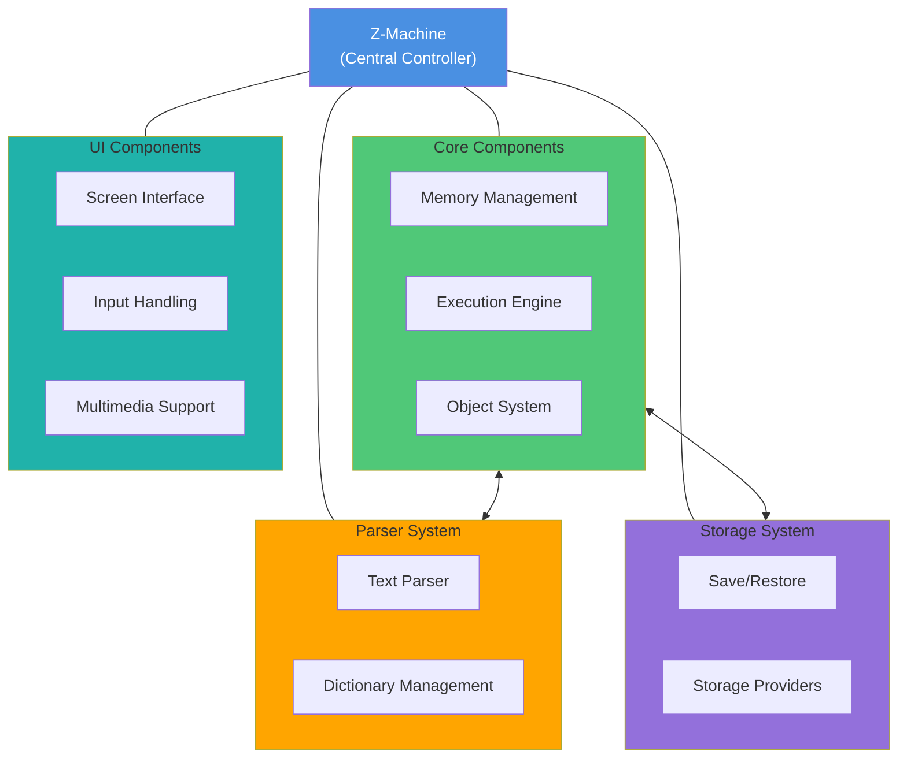

# Rezrov-ZMachine Architecture

## Overview

Rezrov-ZMachine uses a layered, modular architecture that separates the Z-Machine's core functions from interface implementations, enabling adaptability across different environments.

## Architectural Components

### Core System

The core system consists of several key components:

1. **Memory Management**

   - Handles Z-Machine memory model
   - Supports different memory layouts across Z-Machine versions
   - Provides memory access and protection mechanisms

2. **Execution Engine**

   - Implements the Z-Machine instruction set
   - Manages program counter and execution flow
   - Handles opcodes and instruction decoding

3. **Object System**
   - Implements the Z-Machine's unique object hierarchy
   - Supports object attributes, properties, and relationships
   - Provides methods for object manipulation

### Parser System

- **Text Parser**

  - Handles input tokenization
  - Manages dictionary lookups
  - Supports Z-String encoding/decoding

- **Dictionary Management**
  - Implements Z-Machine dictionary operations
  - Supports word lookup and parsing

### Storage System

- Manages game state serialization
- Implements save/restore functionality
- Supports multiple storage providers (file system, browser storage, etc.)

### UI Components

Provides extensible interfaces for:

- Screen rendering
- Input handling
- Multimedia support

## Architectural Diagram

## Key Design Principles

1. **Modularity**: Each component can be easily replaced or extended
2. **Version Agnostic**: Supports multiple Z-Machine versions
3. **Type Safety**: Comprehensive TypeScript typing
4. **Extensibility**: Easy to add new features or modify existing components

## Extensibility Points

- Custom screen implementations
- Alternative storage providers
- Extended input processors
- Version-specific opcode handlers

## Performance Considerations

- Minimal overhead design
- Efficient memory management
- Lazy loading of components
- Optimized for different runtime environments

## Challenges and Solutions

### Version Compatibility

- Dynamic version detection
- Version-specific implementation strategies
- Abstraction layers to handle version differences

### Memory Management

- Strict memory access controls
- Efficient memory mapping
- Support for different memory models across versions

## Future Architecture Improvements

- Enhanced version detection
- More granular component interfaces
- Improved performance optimizations
- Expanded extensibility options
